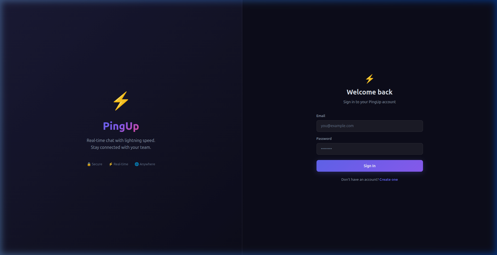
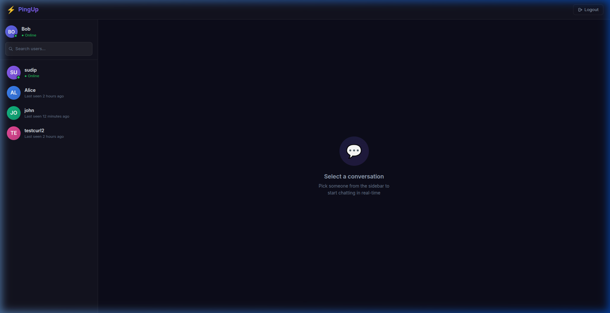
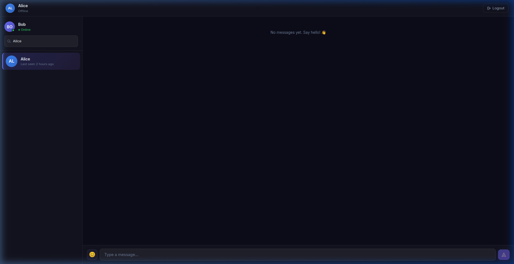

# ⚡ PingUp - Production-Ready Real-Time Chat Application

PingUp is a highly responsive, production-ready real-time chat application featuring JWT Authentication, state-of-the-art glassmorphism styling, typing indicators, online/offline status tracking, custom avatar creation, and instant real-time message delivery over WebSockets.

## 📸 Screenshots

### 🔑 Authentication Page


### 💬 Chat Dashboard


### ✉️ Active Chat Workspace


---

## 🚀 Features

- **🔐 JWT Authentication**: Complete secure authentication workflow (Register, Login, Auto-Login via refresh, Protected routes) with password hashing via Bcrypt.
- **⚡ Real-time Messaging**: WebSocket connections powered by Socket.io, persisting messages instantly to MongoDB and delivering to active clients.
- **🟢 Live Online/Offline Status**: Real-time presence indicators on avatars and last-seen statuses updated on disconnect.
- **✍️ Typing Indicators**: Live typing notifications when the active conversational partner is typing.
- **📭 Unread Counters**: Tracks and highlights new messages in the sidebar if received outside the active chat window.
- **😊 Emoji Picker**: Native emoji integration inside the chat input box.
- **📱 Premium Responsive UI**: Fully adapted dark mode design with sleek hover states, micro-animations, glassmorphism headers, and auto-scrolling message streams.

---

## 🛠️ Tech Stack

### Frontend
- **React (Vite)**
- **React Router DOM** (Route protection & navigation)
- **Axios** (With interceptors to attach tokens & globally handle unauthorized responses)
- **Socket.io Client** (WebSocket client)
- **Tailwind CSS** & **Vanilla Custom CSS variables**
- **React Hot Toast** (Toast notifications)
- **Day.js** (Date & relative timestamp formatting)

### Backend
- **Node.js** & **Express.js** (MVC architecture with ES Modules)
- **MongoDB** & **Mongoose** (Data schemas & query index optimizations)
- **Socket.io** (WebSocket server)
- **JWT & bcryptjs** (Authentication & password security)
- **Helmet & CORS** (Production-grade API security)
- **Morgan** (Development request logging)

---

## 📂 Folder Structure

```
PingUp/
├── backend/
│   ├── src/
│   │   ├── config/        # DB connection setup
│   │   ├── controllers/   # Route controllers (Auth, Users, Messages)
│   │   ├── middleware/    # Route protection, validation, error handler
│   │   ├── models/        # Mongoose Schemas (User, Message)
│   │   ├── routes/        # Express REST API routes
│   │   ├── services/      # Business logic handlers
│   │   ├── socket/        # Socket.io event controllers
│   │   ├── utils/         # Response format helpers, JWT utility
│   │   ├── app.js         # Express Application setup
│   │   └── server.js      # Server entry point (HTTP + Socket server)
│   └── .env               # Backend environment variables
│
└── frontend/
    ├── src/
    │   ├── api/           # Axios instance & API wrapper functions
    │   ├── components/    # Reusable UI elements (Navbar, Sidebar, Bubble, Inputs)
    │   ├── context/       # Auth state provider
    │   ├── pages/         # Application pages (Login, Register, Chat, 404)
    │   ├── routes/        # Auth guard & Public redirect components
    │   ├── socket/        # Reusable client Socket connection manager
    │   ├── utils/         # Date/Time helpers
    │   ├── App.jsx        # Routing configuration
    │   └── main.jsx       # Client entry mount
    └── vite.config.js     # Dev proxy & plugin definitions
```

---

## ⚙️ Environment Variables

### Backend (`backend/.env`)
Create a file named `.env` in the `backend/` directory:
```env
PORT=5000
MONGO_URI=your_mongodb_connection_uri
JWT_SECRET=your_jwt_secret_key
CLIENT_URL=http://localhost:5173
NODE_ENV=development
```

### Frontend
No `.env` file is required for the frontend! The development environment is configured to use Vite's built-in port-forwarding proxy to resolve backend routes cleanly.

---

## 📦 Installation & Setup

1. **Clone the Repository**
   ```bash
   git clone <repository-url>
   cd PingUp
   ```

2. **Setup Backend**
   ```bash
   cd backend
   npm install
   ```

3. **Setup Frontend**
   ```bash
   cd ../frontend
   npm install
   ```

---

## 🏁 Running the Application

### 1. Run the Backend Server
```bash
cd backend
npm run dev
```
The server will start on `http://localhost:5000` and output:
`✅ MongoDB Connected: <host>`
`🚀 PingUp server running on http://localhost:5000`

### 2. Run the Frontend App
```bash
cd frontend
npm run dev
```
Vite will start on `http://localhost:5173`. Open this URL in your web browser.

---

## 🔗 REST API Endpoints

### Authentication
- `POST /api/auth/register` - Create a new user account.
- `POST /api/auth/login` - Authenticate credentials and retrieve user data + token.
- `GET /api/auth/me` - Resolve logged-in user profile (Protected).
- `POST /api/auth/logout` - Set online status to offline (Protected).

### Users
- `GET /api/users` - Return all users except the currently logged-in user to populate the sidebar list (Protected).

### Messages
- `POST /api/messages` - Send a message to a user (Protected).
- `GET /api/messages/:receiverId` - Retrieve the conversation history between the logged-in user and the selected recipient (Protected).

---

## ⚡ Socket.io Flow & Events

When a user logs in, the client initiates a socket connection sending the JWT in the authentication handshake.

```
Client                                                  Server
  │                                                       │
  │ ─── (connect + auth: token) ────────────────────────> │ (Verify JWT, map user to socket)
  │                                                       │ (Set user Online status, notify all)
  │ <── [user_online] ─────────────────────────────────── │
  │                                                       │
  │ ─── (send_message: { receiverId, message }) ───────> │ (Save message to MongoDB)
  │                                                       │ (Forward message to target socket)
  │ <── [receive_message] (To both Sender & Receiver) ─── │
  │                                                       │
  │ ─── (typing: { receiverId }) ───────────────────────> │
  │ <── [typing] (To receiver) ────────────────────────── │
  │                                                       │
  │ ─── (disconnect) ───────────────────────────────────> │ (Set user Offline status, save lastSeen)
  │ <── [user_offline] (To all clients) ───────────────── │
```

---

## 🚀 Deployment Instructions

### Backend (Render / Railway)
1. Link your GitHub repository.
2. Set Root Directory to `backend`.
3. Build command: `npm install`
4. Start command: `node src/server.js`
5. Configure Environment Variables: `MONGO_URI`, `JWT_SECRET`, `CLIENT_URL` (your frontend deployment URL), `PORT` (assigned automatically), `NODE_ENV=production`.

### Frontend (Vercel / Netlify)
1. Link your GitHub repository.
2. Set Root Directory to `frontend`.
3. Build command: `npm run build`
4. Output directory: `dist`
5. Create a `vercel.json` or rewrite rules config if routing breaks on page reload:
   ```json
   {
     "rewrites": [{ "source": "/(.*)", "destination": "/index.html" }]
   }
   ```
